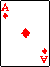



## Slot Poker

### Description

Basically, it uses a random number generator to display 3 different cards in the form window. The name says it all "SlotPoker"... I have not programmed any bells or whistles, you can do that if you wish.
 
### More Info
 
NONE!

Nothing. This is really simple stuff.

A little enjoyment. Maybe!

             |
---                |---
**Submitted On**   |1999-11-28 02:36:38
**By**             |[Scott Rosetta](https://github.com/Planet-Source-Code/PSCIndex/blob/master/ByAuthor/scott-rosetta.md)
**Level**          |Unknown
**User Rating**    |4.2 (159 globes from 38 users)
**Compatibility**  |VB 5\.0, VB 6\.0
**Category**       |[Games](https://github.com/Planet-Source-Code/PSCIndex/blob/master/ByCategory/games__1-38.md)
**World**          |[Visual Basic](https://github.com/Planet-Source-Code/PSCIndex/blob/master/ByWorld/visual-basic.md)
**Archive File**   |[CODE\_UPLOAD1991\.zip](https://github.com/Planet-Source-Code/scott-rosetta-slot-poker__1-4632/archive/master.zip)

